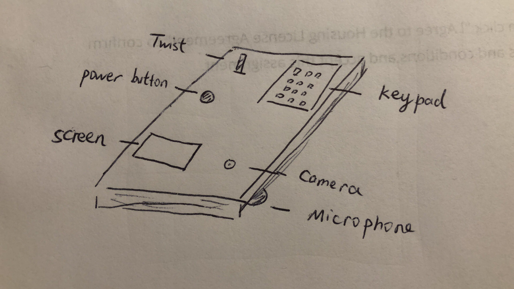

# Tangible Cryptocurrency Safe

Wenqing Tang and Heidi He

## Overview

Our project is about a tangible safe that stores the user's cryptocurrency token in Raspberry Pi.
Users can secure their tokens with password that will be a combination of Qwiic Keypad input and Qwiic Twist input. The safe also has a small screen to display text, a microphone to collect audio input and a speaker to output sounds.

## Features

#### Password Check

The user can set the password with the combination of a number from 0-99 (input from Qwiic Twist) and a PIN with an arbitrary number of digits (in our shown example, it's 4-digit). 

For our current setting, the normal password is 15 + 3428 and the protection password is 88 + 9716.

If the user enters the password wrong for three times in a row, the safe will be locked in 10 seconds. Countdown will be displayed on the screen.

#### Display

The screen will show text hints to let the user know what to do, and when the safe is open, it will also display the number of tokens and print out the token as the user requests.

Opening Screen: "Enter the password to open the safe", number from 0-99 that will update correspond to the Qwiic Twist, password that is shown in "\*" corresponding to the digits the user has entered.

Welcome and Goodbye Animation: A Cornell Tech logo (the twisted "T") will gradually change the color on the screen while the text "CORNELL TECH" will appear character by character.

Main Page in Safe: "You have", number of the tokens the user has in the safe (different during protection mode) in big font size, "tokens"; "Enter a number ends with # to view"

Viewing Token: The token is a 64-digit string and will be displayed in four rows with each row displaying 16 digits.

#### Sound

The safe will output sounds when the user opens the safe, shuts down the safe, inputs the wrong password, asks to check a token, etc.

All the sound resources come from *Portal*: http://www.portal2sounds.com/

Enter the password wrong once: *"If at first you don't succeed, fail 5 more times." (GLaDOS)* 

Enter the password wrong twice: *"How can you fail at this? It isn't even a test." (GLaDOS)*

Enter the password wrong three times: *"That isn't science." (GLaDOS)*

Open the safe (after correct password): *"Oh...it's you." (GLaDOS)*

Open the safe in protection mode: *"Hello, friend." (Turret)*

Main page: *"Oh! That thing has numbers on it." (Turret)*

Enter a token index number: *"Target acquired." (Turret)*

Shutdown the safe: *"It's been fun. Don't come back." (GLaDOS)*

#### Voice Command

When the user is viewing a token, he/she can say "return" to let the safe device return to the main page. 

#### Protection Mode

The safe has a special setting that when a user is being threatened, he/she can enter a different combination of the password that can also open the safe but will activate protection mode. 

In the protection mode:

- The safe will output a green light on Qwiic Twist to let the user know that protection mode has been activated
- The camera will automatically turn on recording and use the "protection" folder to store the captured media with the recording date and time in the filename.
- The safe will say a different welcome message for opening the safe, as shown above in the Sound section.
- Tokens that are marked with "E" (expensive) in the JSON storage will be hidden.

## Design

The sketch above shows our design for the safe.

Parts:

- Raspberry Pi
- USB Microphone
- Sparkfun Qwiic Twist
- Sparkfun Qwiic Keypad
- Sparkfun Qwiic Red Button
- Sparkfun Qwiic Cables
- Mini PiTFT
- Pi Camera
- Speaker

Materials:

- Scissor
- Cutter
- Small Flat Box (about the same length and twice the width as Raspberry Pi)
- Glue
- Tapes

## Demo

Video Link: https://youtu.be/O3sw58zzShQ